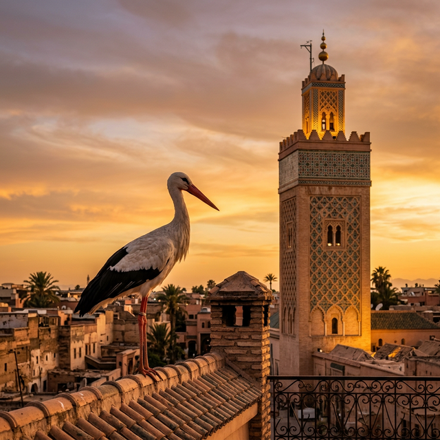

# AMEZIANE TOURS 🦅



A fully responsive, modern, and immersive single-page static website built for **AMEZIANE TOURS**, a premium Moroccan tourism agency specializing in authentic cultural encounters, curated guided tours, and expert local insights. 

---

## ✨ Features

- **Modern UI/UX Design**: Striking, premium layout tailored for travel agencies.
- **Moroccan Aesthetic**: Custom color palette featuring elegant typography and traditional motifs alongside striking imagery.
- **Mobile-First Responsiveness**: Perfect rendering across all devices (Desktop, Tablet, Mobile) using Tailwind CSS Grid and Flexbox.
- **Interactive Elements**: Smooth scrolling for navigation links, subtle animations, and refined hover states on buttons and cards.
- **Production-Ready**: Highly optimized, semantically structured HTML5, utilizing Tailwind CSS via CDN for fast styling without build steps.
- **Key Sections**:
  - **Sticky Navbar** with responsive hamburger menu handling for mobile devices.
  - **Captivating Hero Section** with impactful typography and call-to-action outfitting.
  - **"Our Story" Section** combining compelling narrative with perfectly framed photography.
  - **Experiences Grid** highlighting unique service offerings (Sahara Camps, Imperial Cities, Atlas Treks).
  - **Contact Area** featuring a clean, accessible booking inquiry form alongside comprehensive location and communication details.

---

## 🛠 Tech Stack

- **HTML5:** Strict Semantic Structure
- **CSS:** [Tailwind CSS](https://tailwindcss.com/) (Accessed via CDN)
- **JavaScript:** Minimal Vanilla JS (For mobile menu toggles and navbar scroll styling)
- **Fonts:** 
  - [Inter](https://fonts.google.com/specimen/Inter) (Body)
  - [Merriweather](https://fonts.google.com/specimen/Merriweather) (Headings)
- **Icons:** [FontAwesome 6.4.0](https://fontawesome.com/)

---

## 🚀 Getting Started

Since this is a static single-page application built with standard HTML/CSS/JS, no build tools or package managers are required to run the project. 

### Local Development

1. **Clone the repository:**
   ```bash
   git clone https://github.com/amezianeomar/static-ameziane-tours.git
   ```
2. **Navigate into the project directory:**
   ```bash
   cd static-ameziane-tours
   ```
3. **View the website:**
   Simply double-click the `index.html` file to open it in your default web browser.

   *Alternatively, if you prefer using a local server (recommended for testing responsive features and forms):*
   - Using Python: `python3 -m http.server 8000`
   - Using PHP: `php -S localhost:8000`
   - Using Node.js (if `serve` is installed): `npx serve`

---

## 📁 File Structure

```text
static-ameziane-tours/
│
├── index.html        # Main HTML file containing structure and logic
├── images/           # Directory for application images and logos
│   ├── stork_mosque_portrait.png
│   ├── eagle-logo.png
│   ├── IMG-20240325-WA0013.jpg
│   ├── IMG-20240325-WA0016.jpg
│   └── 8ad9cb1597f7b5dad9b2928b2fdef736.webp
└── README.md         # Documentation
```

---

## 📄 License & Copyright

© 2026 AMEZIANE TOURS. All rights reserved.
